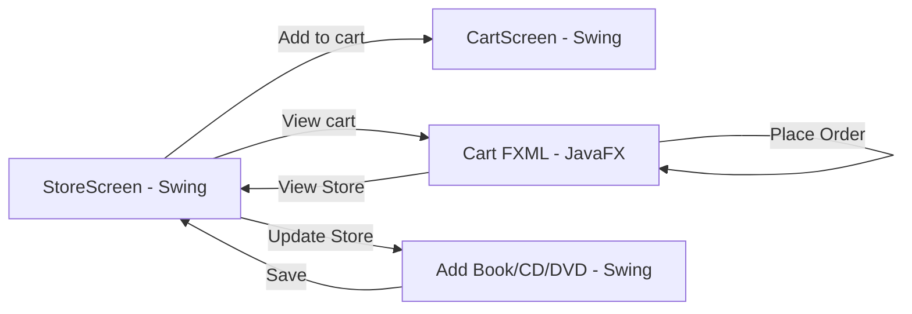

# Báo Cáo Ngắn - Giao Diện JavaFX & AIMS

**Họ và tên:** Vũ Minh Tuấn
**MSSV:** 202417270
**Môn:** Lập trình hướng đối tượng (OOP) — Lab 05

---

## Mục lục ảnh minh họa

| STT | Tên file đề xuất | Mục trong báo cáo | Trạng thái |
|-----|------------------|-------------------|------------|
| 1 | `swing-store.png` | §4.1 — Màn hình Store (Swing)
| 2 | `swing-cart.png` | §4.2 — Màn hình Cart (Swing) | `image-4.png` |
| 3 | `swing-add-book.png` | §4.3.1 — Thêm Book 
| 4 | `swing-add-cd.png` | §4.3.2 — Thêm CD 
| 5 | `swing-add-dvd.png` | §4.3.3 — Thêm DVD 
| 6 | `swing-place-order-dialog.png` | §4.4 — Hộp thoại Place Order 
| 7 | `javafx-cart.png` | §5.1 — Cart JavaFX tổng quan | `image-5.png` |
| 8 | `javafx-cart-filter.png` | §5.2.1 — Lọc theo Title/ID 
| 9 | `javafx-cart-play.png` | §5.2.2 — Dialog Play 
| 10 | `javafx-cart-place-order.png` | §5.2.3 — Dialog Place Order 
| 11 | `javafx-cart-empty.png` | §5.2.4 — Giỏ sau khi đặt hàng 
| 12 | `painter-main.png` | §6.1 — Painter giao diện chính | `image-3.png` |
| 13 | `painter-pen.png` | §6.2 — Vẽ bằng Pen 
| 14 | `painter-eraser.png` | §6.3 — Xóa bằng Eraser 
| 15 | `painter-clear.png` | §6.4 — Sau khi Clear 

---

## 1. Giới thiệu

Báo cáo mô tả các giao diện đồ họa được triển khai trong dự án Lab 05, gồm:

- **AIMS** (Advanced Inventory Management System): quản lý cửa hàng media, giỏ hàng, đặt hàng.
- **Painter**: ứng dụng vẽ đơn giản dùng JavaFX.

Hai công nghệ giao diện được sử dụng song song:

| Công nghệ | Package / file chính | Màn hình |
|-----------|----------------------|----------|
| **Swing** | `aims.screen.*` | Store, Cart, Add Book/CD/DVD |
| **JavaFX** | `cart.fxml`, `CartScreenController`, `Painter.fxml` | Cart (FXML), Painter |

---

## 2. Công nghệ sử dụng

- **JavaFX** — FXML + Controller (`cart.fxml`, `Painter.fxml`, `CartScreenController`, `PainterController`).
- **Swing (javax.swing)** — `StoreScreen`, `CartScreen`, `MediaStore`, `Add*ToStoreScreen`.
- **JavaFX Collections** — `ObservableList`, `FilteredList` trong `Cart` và `CartScreenController`.
- **JavaFX Controls** — `TableView`, `Alert`, `MenuBar`, `BorderPane`.
- **Pane + Shape** — vẽ hình `Circle` khi kéo chuột trong Painter.
- **Comparator** — sắp xếp giỏ hàng theo title/cost (`MediaComparatorByTitleCost`, `MediaComparatorByCostTitle`).

---

## 3. Kiến trúc giao diện AIMS



Luồng người dùng cơ bản: **Xem cửa hàng → Thêm vào giỏ → Xem giỏ → Đặt hàng**.

---

## 4. Các giao diện AIMS (Swing)

### 4.1. Màn hình Store (View Store)


**Hướng dẫn chụp ảnh:** Chạy `StoreScreen` (hoặc mở từ menu Options → View Store), đảm bảo lưới có ít nhất 2–3 sản phẩm demo (DVD/Book/CD).

**Mô tả:**

- Màn hình chính của ứng dụng AIMS, hiển thị danh sách sản phẩm trong cửa hàng.
- Menu **Options**: *Update Store* (Add Book / Add CD / Add DVD), *View Store*, *View Cart*.
- Tiêu đề **AIMS** màu cyan ở header, nút **View cart** bên phải.
- Lưới `GridLayout(3, 3)` với các ô `MediaStore`: tên, giá, nút **Add to cart** và **Play** (nếu media implements `Playable`).

**File liên quan:** `StoreScreen.java`, `MediaStore.java`

---

### 4.2. Màn hình Cart (View Cart — Swing)


**Hướng dẫn chụp ảnh:** Từ Store, thêm vài sản phẩm vào giỏ rồi mở **View cart**. Chụp khi giỏ có nhiều item và dòng **Total** hiển thị đúng.

**Mô tả:**

- Hiển thị các sản phẩm đã thêm vào giỏ hàng (tên + giá từng dòng).
- Dòng **Total** ở cuối danh sách.
- Nút **Place Order** (nền đỏ) và **Close** ở dưới.
- **Place Order** hiện `JOptionPane` xác nhận đơn hàng rồi đóng cửa sổ.

**File liên quan:** `CartScreen.java`

---

### 4.3. Màn hình Update Store — Thêm sản phẩm

#### 4.3.1. Thêm Book


**Hướng dẫn chụp ảnh:** Menu *Options → Update Store → Add Book*. Điền mẫu: Title, Category, Cost, Authors.

**Mô tả:**

- Form nhập **Title**, **Category**, **Cost**, **Authors** (phân cách bằng dấu phẩy).
- Nút **Save** tạo `Book` và thêm vào `Store`, quay lại `StoreScreen`.

**File liên quan:** `AddBookToStoreScreen.java`, `AddItemToStoreScreen.java`

---

#### 4.3.2. Thêm Compact Disc (CD)


**Hướng dẫn chụp ảnh:** Menu *Add CD*. Chụp đủ các trường riêng của CD (artist, director, length… tùy form triển khai).

**Mô tả:**

- Form thêm đĩa CD vào cửa hàng.
- Sau **Save**, sản phẩm xuất hiện trên lưới Store và có thể **Play** nếu là `Playable`.

**File liên quan:** `AddCompactDiscToStoreScreen.java`

---

#### 4.3.3. Thêm Digital Video Disc (DVD)


**Hướng dẫn chụp ảnh:** Menu *Add DVD*. Nhập Title, Cost, Director, Length, Warranty (nếu có).

**Mô tả:**

- Form thêm DVD; tạo `DigitalVideoDisc` và đưa vào `Store`.
- Media DVD có thể phát qua nút **Play** trên `MediaStore`.

**File liên quan:** `AddDigitalVideoDiscToStoreScreen.java`

---

### 4.4. Hộp thoại xác nhận đặt hàng (Swing)


**Hướng dẫn chụp ảnh:** Trong `CartScreen` Swing, nhấn **Place Order** khi giỏ không rỗng. Chụp cả cửa sổ Cart và hộp thoại xác nhận.

**Mô tả:**

- `JOptionPane` hiển thị thông báo đặt hàng thành công.
- Sau xác nhận, cửa sổ Cart đóng (theo logic `CartScreen`).

---

## 5. Giao diện View Cart (JavaFX)

### 5.1. Màn hình View Cart — Tổng quan


**Hướng dẫn chụp ảnh:** Mở giỏ JavaFX từ Store (nút View cart hoặc menu *View Cart*). Giỏ có ít nhất 3 item, Total > 0.

**Mô tả layout (`cart.fxml` — `BorderPane`):**

| Vùng | Thành phần |
|------|------------|
| **TOP** | `MenuBar` (Options) + tiêu đề **CART** (font 50, màu AQUA) |
| **CENTER** | Ô lọc (Filter + TextField + Radio By ID/Title), `TableView` (Title, Category, Cost), nút **Play** / **Remove** |
| **RIGHT** | Label **Total:** + giá trị tổng (AQUA, 24px), nút **Place Order** (nền đỏ, chữ trắng) |

**File liên quan:** `cart.fxml`, `CartScreenController.java`, `CartScreen.java`

---

### 5.2. Các chức năng đã triển khai (kèm ảnh minh họa)

#### 5.2.1. Lọc sản phẩm trong giỏ (Filter)


**Hướng dẫn chụp ảnh:**

1. Nhập từ khóa vào ô **Filter** (ví dụ: `Lion` hoặc `1`).
2. Chọn **By Title** hoặc **By ID**.
3. Chụp khi `TableView` chỉ còn các dòng khớp (real-time qua `FilteredList`).

**Mô tả kỹ thuật:**

- `tfFilter` lắng nghe `textProperty` → gọi `showFilteredMedia()`.
- `radioBtnFilterId` / `radioBtnFilterTitle` đổi tiêu chí lọc.
- Predicate so khớp `id` hoặc `title` (không phân biệt hoa thường).

---

#### 5.2.2. Phát media (Play)


**Hướng dẫn chụp ảnh:**

1. Chọn một dòng DVD hoặc CD trong bảng.
2. Nhấn **Play** (nút chỉ hiện khi media `instanceof Playable`).
3. Chụp `Alert` INFORMATION với nội dung *Playing: …* và độ dài disc.

**Mô tả:**

- Gọi `((Playable) media).play()` rồi hiện `Alert` thông tin.
- Nếu lỗi độ dài (`PlayerException`), hiện `Alert` ERROR.

---

#### 5.2.3. Đặt hàng (Place Order)


**Hướng dẫn chụp ảnh:** Nhấn **Place Order** khi giỏ có sản phẩm. Chụp hộp thoại *Order created. Total cost: … $*.

**Mô tả:**

- Kiểm tra giỏ rỗng → thông báo *The cart is empty*.
- Nếu có hàng: hiện tổng tiền, gọi `cart.clear()`, cập nhật `lblTotalCost`, ẩn nút Play/Remove.

---

#### 5.2.4. Giỏ hàng sau khi đặt hàng


**Hướng dẫn chụp ảnh:** Sau khi đóng dialog Place Order, chụp `TableView` trống và **Total: 0 $**.

**Mô tả:**

- Xác nhận `ObservableList` đã clear và UI đồng bộ.

---

#### 5.2.5. Xóa item (Remove) — *ảnh tùy chọn*


**Hướng dẫn chụp ảnh:** Chọn 1 dòng → **Remove** → chụp bảng còn lại item và Total đã giảm.

---

### 5.3. Điều hướng từ Cart JavaFX về Store

**Mô tả (không bắt buộc ảnh):**

- Menu *Options → View Store* gọi `SwingUtilities.invokeLater(() -> new StoreScreen(store, cart))`.
- Menu *Update Store → Add Book/CD/DVD* mở form Swing tương ứng.

---

## 6. Ứng dụng Painter (JavaFX)

### 6.1. Giao diện chính


**Hướng dẫn chụp ảnh:** Chạy `Painter.java` (cần JavaFX SDK). Chụp toàn cửa sổ: panel **Tools** (Pen/Eraser), nút **Clear**, vùng vẽ trắng.

**Mô tả:**

- Layout `BorderPane`: **LEFT** — công cụ; **CENTER** — `Pane` nền trắng.
- `Painter.fxml` gắn `PainterController`.

**File liên quan:** `Painter.java`, `Painter.fxml`, `PainterController.java`

---

### 6.2. Công cụ Pen (vẽ)


**Hướng dẫn chụp ảnh:** Chọn **Pen**, kéo chuột trên vùng vẽ để tạo các chấm tròn đen (`Circle` bán kính 4).

**Mô tả kỹ thuật:**

- `drawingAreaMouseDragged`: nếu không chọn Eraser → `Color.BLACK`, thêm `Circle` vào `drawingAreaPane`.

---

### 6.3. Công cụ Eraser (tẩy)


**Hướng dẫn chụp ảnh:** Chọn **Eraser**, kéo trên vùng đã vẽ. Các vết tẩy là chấm tròn màu trắng (`Color.WHITE`).

---

### 6.4. Xóa toàn bộ (Clear)


**Hướng dẫn chụp ảnh:** Sau khi vẽ vài nét, nhấn **Clear** → vùng vẽ trống hoàn toàn.

**Mô tả:** `clearButtonPressed()` gọi `drawingAreaPane.getChildren().clear()`.

---

## 7. So sánh Swing và JavaFX trong dự án

| Tiêu chí | Swing (`CartScreen`) | JavaFX (`cart.fxml`) |
|----------|----------------------|----------------------|
| Hiển thị giỏ | `JPanel` + label từng dòng | `TableView` 3 cột |
| Tổng tiền | Label cuối danh sách | `lblTotalCost` bên phải |
| Lọc / tìm kiếm | Không có trên UI | Filter real-time By ID/Title |
| Phát media | Không trên Cart Swing | Nút Play + Alert |
| Đặt hàng | `JOptionPane` | `Alert` JavaFX |
| Thêm vào Store | Form Swing | Menu chuyển sang form Swing |

---

## 8. Hướng dẫn chạy để chụp ảnh

### AIMS — Store & Cart Swing

```bash
# Biên dịch (từ thư mục AimsProject)
javac -d bin -sourcepath src src/hust/soict/dsai/aims/screen/StoreScreen.java

# Chạy
java -cp bin hust.soict.dsai.aims.screen.StoreScreen
```

### AIMS — Cart JavaFX

```bash
# Cần JavaFX SDK, ví dụ:
javac --module-path "$PATH_TO_FX" --add-modules javafx.controls,javafx.fxml \
  -d bin -sourcepath src src/hust/soict/dsai/aims/screen/CartScreen.java

java --module-path "$PATH_TO_FX" --add-modules javafx.controls,javafx.fxml \
  -cp bin hust.soict.dsai.aims.screen.CartScreen
```

### Painter

```bash
cd GUIProject
./build.sh
./run.sh
```

---

## 9. Kết luận

- Đã triển khai đầy đủ luồng AIMS: **Store → Add to cart → View Cart → Place Order** trên cả Swing và JavaFX.
- **Cart JavaFX** bổ sung filter, play, remove và binding tổng tiền qua `ObservableList`.
- **Painter** minh họa FXML + Controller, xử lý sự kiện chuột và vẽ bằng `Circle`.
- Báo cáo cần bổ sung **các ảnh đánh dấu "Cần chụp"** trong bảng mục lục để hoàn thiện minh chứng thực nghiệm.

---


